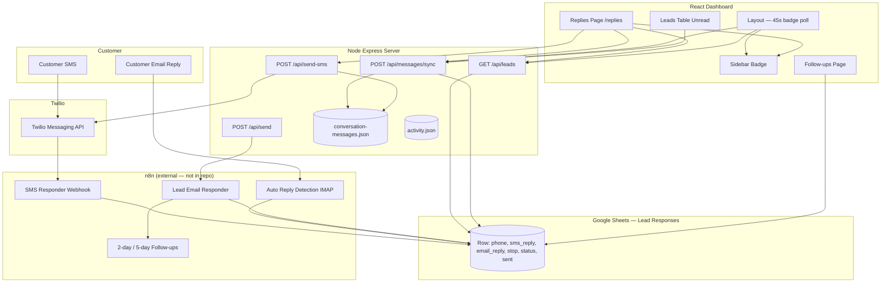
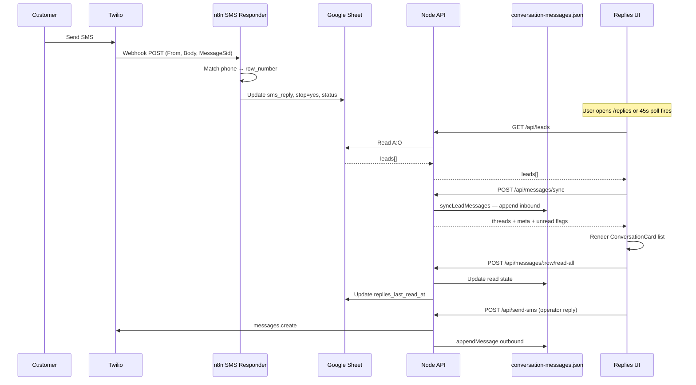
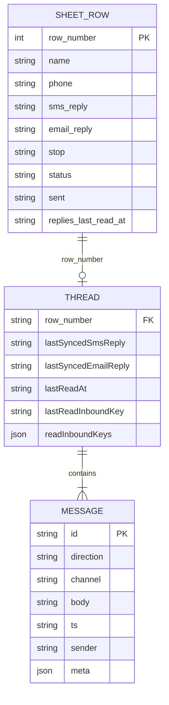
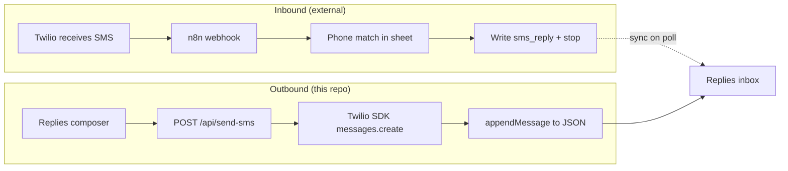
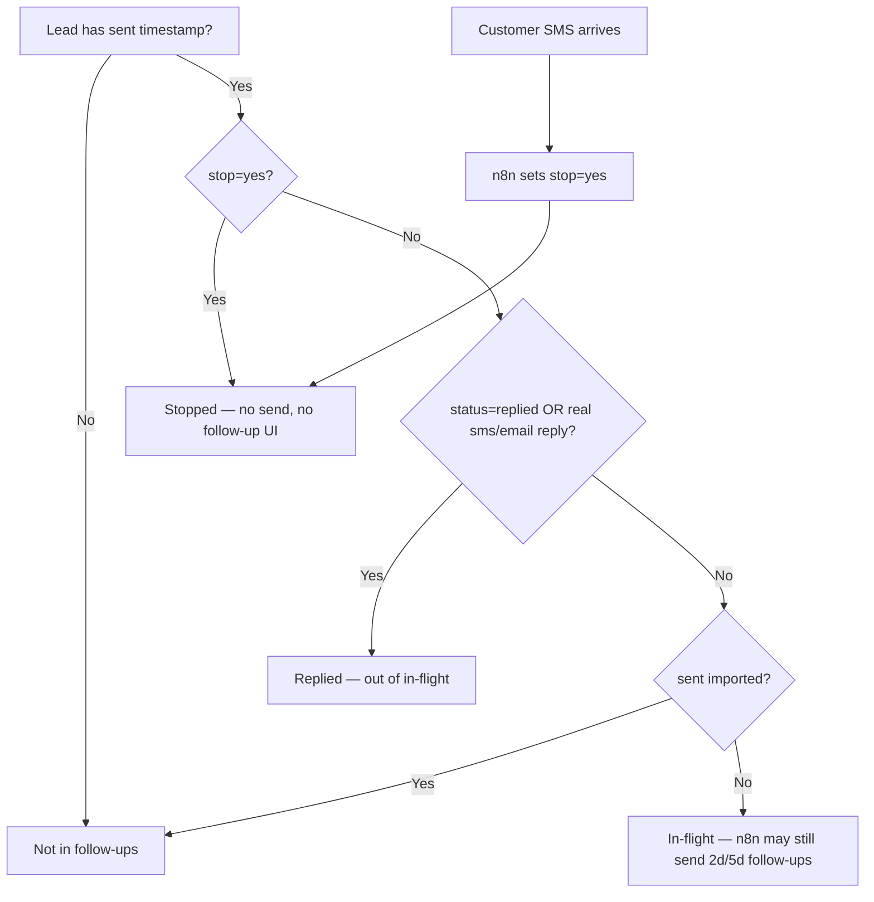

# SMS Reply System — Technical Architecture & Audit

> **⚠️ Do Not Modify Yet**
>
> This document is **read-only analysis**. It describes the current SMS Reply system as implemented in this repository. Do **not** refactor, migrate, or change production code based on assumptions here until you have validated external dependencies (especially **n8n workflows**) in the live environment.

---

## Table of Contents

1. [High-Level Overview](#1-high-level-overview)
2. [Complete Data Flow](#2-complete-data-flow)
3. [File Breakdown](#3-file-breakdown)
4. [Database Architecture](#4-database-architecture)
5. [Twilio Integration](#5-twilio-integration)
6. [Lead Matching Logic](#6-lead-matching-logic)
7. [Reply Dashboard](#7-reply-dashboard)
8. [Notification System](#8-notification-system)
9. [Follow-Up Stop Logic](#9-follow-up-stop-logic)
10. [API Endpoints](#10-api-endpoints)
11. [Environment Variables](#11-environment-variables)
12. [Error Handling](#12-error-handling)
13. [Current Limitations](#13-current-limitations)
14. [Improvement Opportunities](#14-improvement-opportunities)
15. [Mermaid Diagrams](#15-mermaid-diagrams)
16. [Executive Summary](#16-executive-summary)
17. [Claude Code Handoff Summary](#claude-code-handoff-summary)

---

## 1. High-Level Overview

### What the SMS Reply system does

The SMS Reply system lets Green Shield Pest Solutions **detect, track, read, and respond to inbound customer SMS (and email) replies** within the CRM dashboard. It:

- Surfaces conversations in the **Replies** inbox (`/replies`)
- Maintains **append-only conversation history** per lead (server JSON store)
- Shows **unread badges** in the sidebar and on the Leads table
- Lets operators **send outbound SMS** directly from the Replies composer (Twilio SDK)
- Provides an **AI reply assistant** (Claude) to draft responses
- **Stops automated follow-up sequences** when a customer replies (via external n8n automation + `stop=yes` on the lead row)

### Why it exists

Outbound template sends (NA, AG, RIT, etc.) trigger n8n sequences with 2-day and 5-day follow-ups. When customers text back, the business must:

1. Know immediately that a reply arrived
2. Stop further automated messages
3. Respond manually with context
4. Avoid duplicate or inappropriate automated touches

### Business problem it solves

- **Operational:** Centralizes two-way SMS in one inbox instead of checking Twilio or the spreadsheet manually
- **Compliance / customer experience:** Automatically halts follow-ups when customers reply or opt out
- **Sales velocity:** Unread indicators and dashboard activity feed prioritize hot leads

### How it fits into the CRM workflow

```text
Intake / manual lead add → Send Template (n8n) → Follow-ups page (in-flight)
                                    ↓
                         Customer replies (SMS/email)
                                    ↓
                    n8n updates Google Sheet (sms_reply, stop)
                                    ↓
              Replies inbox syncs sheet → conversation threads
                                    ↓
              Operator reads, AI-assists, sends SMS reply
```

The CRM does **not** own inbound webhook ingestion. It **reads** reply state from Google Sheets and **writes** conversation history + read state locally (and partially back to the sheet).

---

## 2. Complete Data Flow

### End-to-end: Customer sends SMS → appears in UI

| Step | Layer | What happens |
|------|-------|--------------|
| 1 | **Customer** | Sends SMS to Green Shield Twilio number |
| 2 | **Twilio** | Receives message; POSTs webhook to configured URL (n8n, not this repo) |
| 3 | **n8n — SMS Responder** | Workflow `Z1L9diiP8vG8Xwn0` at `/webhook/85f92afd-4902-4083-b932-fa694217611e` processes payload |
| 4 | **n8n — lead matching** | Matches `From` phone to a row in Google Sheet `Lead Responses` (logic **not in repo**) |
| 5 | **Google Sheets** | Updates row: `sms_reply` (text or `yes`), likely `stop=yes`, likely `status=replied` |
| 6 | **Dashboard poll / page load** | `Layout.jsx` polls every 45s OR user opens `/replies` |
| 7 | **`GET /api/leads`** | Server reads sheet columns A–O; returns all non-deleted leads |
| 8 | **Client filter** | `hasConversationSignal()` keeps leads with non-empty `sms_reply` / `email_reply` (not `.`) |
| 9 | **`POST /api/messages/sync`** | Server `syncLeadMessages()` converts sheet scalars → append-only thread in `conversation-messages.json` |
| 10 | **Unread evaluation** | `isThreadUnread()` compares latest inbound timestamp/key vs `lastReadAt` / `readInboundKeys` |
| 11 | **Badge update** | Sidebar badge via poll or `replies-unread-count` CustomEvent |
| 12 | **UI render** | `ConversationCard` rows in Replies inbox; selecting opens `ChatThread` + `ReplyComposer` |
| 13 | **Mark read** | `POST /api/messages/:row/read-all` → JSON store + `replies_last_read_at` column on sheet |
| 14 | **Operator reply** | `POST /api/send-sms` → Twilio outbound + `appendMessage()` to thread |

### Parallel path: Email reply

| Step | Layer | What happens |
|------|-------|--------------|
| 1 | **Customer** | Replies to outreach email |
| 2 | **n8n — Auto Reply Detection** | IMAP trigger workflow `soqaI8mHP2iSYAjZ` |
| 3 | **Google Sheets** | Updates `email_reply`, sets stop (per workflow catalog description) |
| 4+ | **Same as SMS** | Sync, unread, Replies UI (channel = `email` in thread) |

### Outbound template send (starts follow-ups — context for reply stopping)

| Step | What happens |
|------|--------------|
| 1 | User sends template via Send Template page |
| 2 | `POST /api/send` → `triggerLeadWebhook()` → n8n Lead Email Responder |
| 3 | n8n sends initial SMS/email + schedules 2-day / 5-day follow-ups |
| 4 | Server updates sheet `sent` timestamp (if not TEST_MODE) |
| 5 | Follow-ups page shows lead as "in flight" until reply or stop |

---

## 3. File Breakdown

### Server — core reply pipeline

#### `server/index.js`

| | |
|---|---|
| **Purpose** | Express app bootstrap; mounts routers; **only Twilio usage in repo** for outbound SMS |
| **Key routes** | `POST /api/send-sms` (inline, not in router module) |
| **Imports** | `twilio`, `appendMessage` from `conversationMessages.js`, route modules |
| **Exports** | None (entry point) |
| **Functions** | Twilio client init; phone normalization (`+1` E.164); `messages.create()`; optional `appendMessage()` after send |
| **Dependencies** | `TWILIO_*` env vars, `conversationMessages.js` |

#### `server/routes/messages.js`

| | |
|---|---|
| **Purpose** | REST API for conversation sync, read state, thread CRUD |
| **Exports** | Default Express router mounted at `/api/messages` |
| **Handlers** | `POST /sync`, `POST /unread-count`, `POST /migrate-local`, `GET/POST /:rowNumber`, `POST /:rowNumber/read`, `POST /:rowNumber/read-all` |
| **Dependencies** | `server/services/conversationMessages.js` |

#### `server/services/conversationMessages.js`

| | |
|---|---|
| **Purpose** | **Authoritative conversation thread store** (JSON file); syncs sheet reply fields into append-only history |
| **Exports** | `syncLeadMessages`, `syncLeadsMessages`, `appendMessage`, `markThreadRead`, `markAllInboundRead`, `getMessagesForLead`, `countUnreadForLeads`, `stableInboundTs`, `inboundReadKey`, `getConversationPreview`, `mergeLocalOutboundHistory`, etc. |
| **Storage** | `server/data/conversation-messages.json` (gitignored) |
| **Key logic** | `recoverAndAppendSheetReply()` — preserves prior SMS when sheet overwrites scalar field; `isRealReplyText()` / `isFlagOnly()` for `yes` placeholder messages |
| **Dependencies** | `fs`, dynamic import of `sheets.js` for `replies_last_read_at` persistence |

#### `server/services/sheets.js`

| | |
|---|---|
| **Purpose** | Google Sheets read/write for `Lead Responses` tab |
| **Exports** | `getLeads`, `updateLead`, `appendLead`, `COLUMNS`, `SHEET_NAME` |
| **Columns** | 15 fields A–O (see Database Architecture) |
| **Dependencies** | `googleapis`, `googleCredentials.js`, `SHEET_ID`, `SHEET_NAME`, `TEST_MODE` |

#### `server/services/n8n.js`

| | |
|---|---|
| **Purpose** | n8n workflow catalog metadata; triggers outbound template webhook |
| **Exports** | `WORKFLOW_CATALOG`, `triggerLeadWebhook`, `getWorkflowStatuses` |
| **SMS relevance** | Documents **SMS Responder** inbound webhook URL (external); does not implement it |
| **Dependencies** | `N8N_BASE_URL`, `N8N_LEAD_WEBHOOK_PATH`, `N8N_API_KEY` |

#### `server/routes/leads.js`

| | |
|---|---|
| **Purpose** | Lead CRUD; manual stop/unstop |
| **Reply-related** | `POST /:rowNumber/stop` → `{ stop: 'yes', status: 'stopped' }`; `POST /:rowNumber/unstop` → clears stop |
| **Dependencies** | `sheets.js`, `activity.js` |

#### `server/routes/send.js`

| | |
|---|---|
| **Purpose** | Trigger n8n template send sequence |
| **Reply-related** | Blocks send if `lead.stop === 'yes'` |
| **Dependencies** | `n8n.js`, `sheets.js`, `activity.js` |

#### `server/routes/ai.js`

| | |
|---|---|
| **Purpose** | AI copilot for drafting reply text in Replies inbox |
| **Endpoints** | `POST /assist-reply`, `POST /draft-reply` (deprecated) |
| **Reply-related** | `detectEscalation()` — blocks drafting if `context.stop` is true |
| **Dependencies** | `@anthropic-ai/sdk`, `ANTHROPIC_API_KEY`, `knowledge.js` |

#### `server/services/activity.js`

| | |
|---|---|
| **Purpose** | Local JSON audit log (`server/data/activity.json`) |
| **Reply-related** | Logs `template_sent`, `lead_stopped`, `lead_unstopped` — **does not log inbound SMS** |
| **Exports** | `readLog`, `appendLog`, `clearLog` |

#### `server/routes/activity.js`

| | |
|---|---|
| **Purpose** | `GET/POST/DELETE /api/activity` for audit log UI |
| **Reply-related** | Indirect — Activity Log page shows template sends and stops, not inbound messages |

#### `server/routes/workflows.js`

| | |
|---|---|
| **Purpose** | `GET /api/workflows` — lists n8n workflows including SMS Responder |
| **Dependencies** | `n8n.js` |

#### `server/services/__tests__/conversationMessages.test.js`

| | |
|---|---|
| **Purpose** | Unit tests for sheet overwrite recovery, read state, mark-all-read, template messages |

---

### Client — Replies inbox & related UI

#### `client/src/pages/Replies.jsx`

| | |
|---|---|
| **Purpose** | **Main Replies page orchestrator** — data loading, selection, send, AI, unread broadcast |
| **Route** | `/replies` (lazy in `App.jsx`) |
| **Key functions** | `loadLeads()`, `handleSend()`, `handleAIAssist()`, `markReadWithMeta()`, deep-link via `?row=` or `state.selectRowNumber` |
| **Hooks used** | `useConversationThreads`, `useUnreadReplies`, `useReplySelection`, `useReplyArchive`, `useReplyCardState` |
| **API calls** | `api.leads.list`, `api.messages.sync`, `api.messages.list`, `api.messages.markReadAll`, `api.sms.send`, `api.ai.assistReply` |
| **Events** | Dispatches `replies-unread-count` CustomEvent |

#### `client/src/pages/Replies/ReplyInbox.jsx`

| | |
|---|---|
| **Purpose** | Two-pane shell: conversation list + detail workspace |
| **Children** | `ConversationList` + detail slot (`ReplyConversationView` / `ReplyArchivedDetail`) |

#### `client/src/pages/Replies/ConversationList.jsx`

| | |
|---|---|
| **Purpose** | Search box; Active / Archived sections; maps leads to `ConversationCard` |

#### `client/src/pages/Replies/ConversationCard.jsx`

| | |
|---|---|
| **Purpose** | Single inbox row — preview, unread styling, pulse animation, status dot |

#### `client/src/pages/Replies/ReplyConversationView.jsx`

| | |
|---|---|
| **Purpose** | Active thread: archive confirm, `ChatThread`, `ReplyComposer`, `AiResponseAssistant` |

#### `client/src/pages/Replies/ChatThread.jsx`

| | |
|---|---|
| **Purpose** | Message scroll area, header meta, date dividers via `buildThreadWithDateDividers` |

#### `client/src/pages/Replies/MessageBubble.jsx`

| | |
|---|---|
| **Purpose** | Renders individual SMS/email bubble (inbound vs outbound styling) |

#### `client/src/pages/Replies/ReplyComposer.jsx`

| | |
|---|---|
| **Purpose** | SMS textarea, Send button, keyboard Enter-to-send |

#### `client/src/pages/Replies/AiResponseAssistant.jsx`

| | |
|---|---|
| **Purpose** | Quick AI prompt chips + custom instruction field |

#### `client/src/pages/Replies/useConversationThreads.js`

| | |
|---|---|
| **Purpose** | Thread state; `syncLeads()`, `loadThread()`, optimistic append; one-time localStorage migration |
| **API** | `messages.sync`, `messages.list`, `messages.migrateLocal` |

#### `client/src/pages/Replies/useUnreadReplies.js`

| | |
|---|---|
| **Purpose** | Per-row read state; `isUnread()`, `markRead()` → `markReadAll`, pulse on new inbound |
| **API** | `api.messages.markReadAll` |

#### `client/src/pages/Replies/readState.js`

| | |
|---|---|
| **Purpose** | Shared unread predicate `isInboundNewerThanRead()` — used by Replies + Leads |

#### `client/src/pages/Replies/conversationLeadFilter.js`

| | |
|---|---|
| **Purpose** | `hasConversationSignal()` — inbox eligibility filter |
| **Rule** | `sms_reply` or `email_reply` non-empty and not `.` |

#### `client/src/pages/Replies/threadUtils.js`

| | |
|---|---|
| **Purpose** | Thread building, search, sort, `inboundReadKey`, archive key, status tone (green/red) |
| **Key exports** | `buildThread`, `partitionSearchedReplyLeads`, `getConversationSortTime`, `archKey` |

#### `client/src/pages/Replies/buildLeadContext.js`

| | |
|---|---|
| **Purpose** | Builds `lead_context` payload for AI assist from lead + messages |

#### `client/src/pages/Replies/useReplyArchive.js`

| | |
|---|---|
| **Purpose** | Client-only archive state in `localStorage` (`gs_archived_replies`); key = `row_number:sms_reply` |

#### `client/src/pages/Replies/constants.js`

| | |
|---|---|
| **Purpose** | `ARCHIVE_KEY`, `HISTORY_KEY`, `VIEWED_KEY`, template labels/colors |

#### `client/src/pages/Replies/legacyViewedKeys.js`

| | |
|---|---|
| **Purpose** | Migrates pre-server-read-state "viewed" keys from localStorage for badge consistency |

#### `client/src/api/client.js`

| | |
|---|---|
| **Purpose** | Fetch wrapper for all `/api/*` endpoints |
| **Reply methods** | `api.leads.*`, `api.messages.*`, `api.sms.send`, `api.ai.assistReply` |

#### `client/src/components/Layout.jsx`

| | |
|---|---|
| **Purpose** | App shell; **sidebar unread badge polling** every 45s |
| **API** | `api.leads.list` + `api.messages.unreadCount` |
| **Events** | Listens for `replies-unread-count` |

#### `client/src/components/AppSidebar.jsx`

| | |
|---|---|
| **Purpose** | Renders Replies nav item with badge count (`badge: 'replied'`) |

#### `client/src/components/sidebarNav.js`

| | |
|---|---|
| **Purpose** | Nav config — Replies at `/replies` with `badge: 'replied'` |

#### `client/src/pages/Leads/useLeadsUnreadState.js`

| | |
|---|---|
| **Purpose** | Highlights unread leads in Leads table; marks read on detail open |
| **API** | `api.messages.unreadCount`, `api.messages.list`, `api.messages.markReadAll` |

#### `client/src/pages/Followups/followupsUtils.js`

| | |
|---|---|
| **Purpose** | Follow-up eligibility — `isInFlightFollowup()`, `isRepliedFollowup()`, `isStoppedFollowup()` |
| **Reply-related** | Determines which leads still receive automated follow-ups in UI |

#### `client/src/pages/CRMPreview/mockData.js`

| | |
|---|---|
| **Purpose** | `deriveStats()`, `hasRealReply()` — dashboard KPIs including reply counts |
| **Used by** | `Layout.jsx` (stats), dashboard pipeline widgets |

#### `client/src/pages/CRMPreview/components/PipelineSummary/derivePipelineDashboard.js`

| | |
|---|---|
| **Purpose** | Builds synthetic "Today's Activity" feed including `type: 'reply'` items |

#### `client/src/pages/CRMPreview/components/PipelineSummary/activityFeedNavigation.js`

| | |
|---|---|
| **Purpose** | Click handler for reply activity → `/replies?row=N` |

---

### Legacy / unused (still in repo)

| File | Notes |
|------|-------|
| `client/src/pages/Replies/ReplyListItem.jsx` | Superseded by `ConversationCard`; not imported |
| `client/src/pages/Replies/UnreadPulseBadge.jsx` | Returns `null`; pulse is CSS on card |
| `client/src/pages/Replies/useChatHistory.js` | Legacy localStorage; migration path exists via `useConversationThreads` |
| `client/src/pages/Replies/ChatMessage.jsx` | Older bubble; `ChatThread` uses `MessageBubble` |
| `server/routes/sessions.js` | Exists but **not mounted** in `server/index.js` |

---

## 4. Database Architecture

**There is no SQL database, ORM, Prisma, or migrations.** Reply data lives in:

1. **Google Sheet** — source of truth for lead reply **flags** and **stop** state
2. **`server/data/conversation-messages.json`** — append-only **conversation threads**
3. **`server/data/activity.json`** — dashboard action audit (not inbound SMS events)
4. **Browser `localStorage`** — archive sets, legacy viewed keys, migrated outbound history

### Google Sheet: `Lead Responses` (columns A–O)

Defined in `server/services/sheets.js`:

```javascript
const COLUMNS = [
  'name', 'reason', 'email', 'notes', 'status', 'sent', 'error', 'stop',
  'phone', 'phone_formatted', 'sms_reply', 'email_reply', 'deleted', 'sold',
  'replies_last_read_at'
];
```

| Column | Field | Reply system role |
|--------|-------|-------------------|
| A | `name` | Display name in inbox |
| B | `reason` | Lead reason / context |
| C | `email` | Email channel |
| D | `notes` | Template code (`na`, `ag`, `rit`, `iq`, `t/m`) |
| E | `status` | e.g. `replied`, `stopped`, `active`, `sent`, `error` |
| F | `sent` | ISO timestamp of last template send |
| G | `error` | Send error message |
| H | `stop` | `'yes'` = follow-ups halted + blocks new template send |
| I | `phone` | Raw phone — used for outbound Twilio sends |
| J | `phone_formatted` | Display formatting (not used by Node matching logic) |
| K | `sms_reply` | Latest SMS reply text, `'yes'` flag, or `'.'` (empty sentinel) |
| L | `email_reply` | Latest email reply text or flag |
| M | `deleted` | `'yes'` = filtered out on read |
| N | `sold` | Sale flag |
| O | `replies_last_read_at` | ISO timestamp — read cursor synced from Replies UI |

**Row identity:** `row_number` = sheet row index (1-based header; data starts row 2 → `row_number = index + 2`).

### Reply field semantics

| Value | Meaning |
|-------|---------|
| `''` or missing | No reply |
| `'.'` | Explicit empty / no conversation (filtered out of inbox) |
| `'yes'` | Reply detected but body not stored — UI shows placeholder `"(Customer replied via SMS)"` |
| Any other text | Actual reply body (may be overwritten on next reply — history recovered in JSON store) |

### JSON store: `conversation-messages.json`

```json
{
  "threads": {
    "<row_number>": {
      "messages": [ /* Message[] */ ],
      "lastSyncedSmsReply": "",
      "lastSyncedEmailReply": "",
      "lastReadInboundKey": null,
      "lastReadAt": null,
      "readInboundKeys": []
    }
  }
}
```

### Message object shape

| Field | Type | Values |
|-------|------|--------|
| `id` | string | Generated ID |
| `direction` | string | `inbound` \| `outbound` |
| `channel` | string | `sms` \| `email` |
| `body` | string | Message text |
| `ts` | string | ISO timestamp |
| `sender` | string | e.g. customer name, `'You'`, `'Green Shield'` |
| `status` | string? | Outbound delivery status |
| `meta` | object? | e.g. `{ twilioSid }`, `{ flagOnly: true }`, `{ isTemplate: true }` |

### Unread state model

Unread is computed — not a stored boolean on the sheet (except indirectly via `replies_last_read_at`):

1. Find **latest inbound** message in thread
2. Compare `lastInboundAt` vs `lastReadAt` (timestamp)
3. Fallback: compare `inboundReadKey` vs `lastReadInboundKey` / `readInboundKeys`
4. Client may also honor `meta.unread === false` after optimistic mark-read

**Stable read key format:**

```javascript
`${channel}|${ts}|${body}`  // e.g. "sms|2024-01-15T...|Hello"
```

### Relationships (conceptual)

```text
Google Sheet Row (row_number)
    ├── scalar fields: sms_reply, email_reply, stop, status, replies_last_read_at
    └── 1:1 → conversation-messages.json thread[row_number]
              └── 1:N → messages[] (inbound/outbound)
```

Archive state is **client-only** (`localStorage`), keyed by `row_number:sms_reply` — not server-persisted.

---

## 5. Twilio Integration

### Connection model

| Direction | Handler | Location |
|-----------|---------|----------|
| **Inbound SMS** | n8n SMS Responder webhook | **External** — not in this repo |
| **Outbound SMS** | Express `POST /api/send-sms` | `server/index.js` |

Twilio SDK initialization:

```javascript
const twilioClient = twilio(
  process.env.TWILIO_ACCOUNT_SID,
  process.env.TWILIO_AUTH_TOKEN
);
```

### Outbound send flow (`POST /api/send-sms`)

**Request body:**

```json
{
  "phone": "2075551234",
  "message": "Thanks for reaching out!",
  "row_number": 42,
  "name": "Jane Doe"
}
```

**Processing:**

1. Validate `phone` and `message` present
2. Strip non-digits; prefix `+1` if needed → E.164
3. `twilioClient.messages.create({ body, from: TWILIO_PHONE_NUMBER, to })`
4. If `row_number` provided → `appendMessage()` with `meta: { twilioSid }`
5. Return `{ success, sid, phone, message, persistedMessage }`

**There is no Twilio signature validation, status callback webhook, or inbound route in this codebase.**

### Inbound webhook (external — n8n)

From `server/services/n8n.js` catalog:

| Property | Value |
|----------|-------|
| Workflow name | SMS Responder |
| Workflow ID | `Z1L9diiP8vG8Xwn0` |
| Webhook URL | `{N8N_BASE_URL}/webhook/85f92afd-4902-4083-b932-fa694217611e` |
| Documented behavior | "Handles incoming Twilio SMS replies — marks lead as replied and sets stop=yes automatically" |

**Expected Twilio → n8n payload** (standard Twilio Messaging webhook — inferred, not verified in repo):

| Field | Typical use |
|-------|-------------|
| `From` | Customer phone — used for lead matching in n8n |
| `To` | Twilio number |
| `Body` | Message text → written to `sms_reply` |
| `MessageSid` | Twilio message ID |
| `AccountSid` | Twilio account |

**Verification:** Twilio supports `X-Twilio-Signature` HMAC validation — implementation would be in n8n, not here.

### Gmail integration (reply-related)

| Component | Role |
|-----------|------|
| n8n **Auto Reply Detection** (IMAP) | Inbound **email** reply detection → sheet update |
| `GMAIL_USER` / `GMAIL_APP_PASSWORD` | Used for **outbound** quote/agreement emails in `documents.js` / signing — **not** inbound reply ingestion |
| AI assist context | Reads `email_reply` boolean from lead context |

Email replies flow: **Gmail IMAP → n8n → Google Sheet `email_reply` + `stop` → backend sync**.

---

## 6. Lead Matching Logic

### Critical finding: matching is NOT implemented in this Node backend

The Express server **never** receives raw inbound SMS or matches phones to leads. It assumes:

- n8n has already matched the phone and updated the correct sheet row
- The client knows `row_number` from `GET /api/leads`

### Where matching happens (external)

**n8n SMS Responder workflow** (not in repo) — expected behavior based on catalog + SETUP.md:

1. Receive Twilio webhook with `From` phone
2. Look up row in `Lead Responses` where `phone` or `phone_formatted` matches
3. Write `sms_reply` and set `stop=yes`
4. Possibly set `status=replied`

### Phone normalization (outbound only)

```javascript
const cleanPhone = String(phone).replace(/\D/g, '');
const toNumber = cleanPhone.startsWith('1') ? `+${cleanPhone}` : `+1${cleanPhone}`;
```

No equivalent normalization exists server-side for inbound matching.

### Client-side "matching" (display/search only)

| Function | File | Purpose |
|----------|------|---------|
| `hasConversationSignal()` | `conversationLeadFilter.js` | Filter leads into Replies inbox |
| `leadMatchesConversationSearch()` | `threadUtils.js` | Search by name, phone, reply text, thread bodies |
| Deep link | `Replies.jsx` | `?row=N` or `state.selectRowNumber` selects known row |

### Email matching

Same external n8n IMAP workflow — likely matches on `email` column. Not implemented in Node.

### Duplicate handling

| Scenario | Behavior |
|----------|----------|
| Same inbound body re-synced | `appendInboundIfNew()` + `findInboundByContent()` dedupes |
| Sheet overwrites `sms_reply` with new text | `recoverAndAppendSheetReply()` preserves **previous** value in JSON history once |
| Multiple leads same phone | **Undefined in repo** — depends on n8n sheet lookup (likely first match or last updated) |
| Missing lead for phone | **Undefined in repo** — n8n may log error or ignore; no dead-letter queue in this codebase |

---

## 7. Reply Dashboard

### Route & entry

- **URL:** `/replies`
- **Component:** `client/src/pages/Replies.jsx`
- **Nav:** Sidebar → Replies (badge = unread count)

### Component hierarchy

```text
Replies.jsx
├── RepliesAmbientBackground
├── ReplyPageHeader (refresh, archive toggle, live dot)
├── Toast notifications
└── ReplyInbox
    ├── ConversationList
    │   ├── Search input
    │   ├── Section: Active (N)
    │   │   └── ConversationCard × N
    │   └── Section: Archived (N) [optional]
    │       └── ConversationCard × N
    └── main (detail pane)
        └── WorkspaceSwap
            ├── ReplyConversationView (active)
            │   ├── Archive confirm banner
            │   ├── ChatThread → MessageBubble × N
            │   └── ReplyComposer
            │       └── AiResponseAssistant
            ├── ReplyArchivedDetail (read-only + restore)
            └── Empty state ("Select a conversation")
```

### How conversations are loaded

1. `loadLeads()` → `api.leads.list()`
2. Filter → `hasConversationSignal()`
3. `syncLeads()` → `api.messages.sync(leads, legacyViewedKeys)`
4. On select → `loadThread(row)` → `api.messages.list(row)`
5. Manual refresh via header button repeats step 1–3

### How conversations are grouped

| Dimension | Logic |
|-----------|-------|
| **Inbox eligibility** | Has non-empty `sms_reply` or `email_reply` (not `.`) |
| **Sort** | `getConversationSortTime()` — meta.lastAt → last message ts → lead.sent |
| **Active vs archived** | `archKey(lead) = row_number:sms_reply` in localStorage set |
| **Search** | Name, phone, scalar replies, message bodies |

### Unread behavior

- **List row:** `isUnread(lead, messages, meta)` → CSS classes `rc-conv-card--unread`, `--pulse`
- **On select:** `markReadWithMeta()` → optimistic local state + `api.messages.markReadAll`
- **Archived rows:** Unread styling forced off in list

### Outbound from dashboard

`handleSend()` → `api.sms.send(phone, msg, row_number, name)` → Twilio + thread append

### AI assist

`handleAIAssist()` → `buildLeadContext()` + `api.ai.assistReply()` → populates composer textarea

---

## 8. Notification System

There is **no push notification, email alert, or WebSocket** for new replies.

### Sidebar badge

| Source | Mechanism |
|--------|-----------|
| **Polling** | `Layout.jsx` every **45 seconds** + on tab visibility restore |
| **Event push** | `window.dispatchEvent(new CustomEvent('replies-unread-count', { detail: { count } }))` from Replies/Leads pages |
| **Computation** | `POST /api/messages/unread-count` after filtering conversation leads |
| **Display** | `AppSidebar.jsx` → `getBadgeCount('replied')` → green badge with count |

### Leads table highlight

- `useLeadsUnreadState.js` — same `unreadCount` API
- Rows highlighted when `row_number` in unread set
- Opening lead detail → auto `markReadAll`

### Dashboard activity feed

- **Not real-time** — derived client-side from lead data in `derivePipelineDashboard.js`
- Shows up to 2 replied leads as `type: 'reply'` items
- Click navigates to `/replies?row=N`
- Cosmetic reorder animation every 3.2s (`useLiveActivityFeed`) — **does not fetch new data**

### Pulse animation

- `useUnreadReplies.notifyNewInbound()` — detects new inbound during sync vs previous thread snapshot
- Adds row to `pulseRows` Set → CSS pulse on card

### Activity Log page (`/activity`)

- Shows `template_sent`, `lead_stopped`, etc.
- **Does not show inbound SMS events** — no server logging for those

### Trigger locations summary

| Event | Logged? | Badge updated? | UI surface |
|-------|---------|----------------|------------|
| Inbound SMS (n8n → sheet) | No | On next poll/sync | Replies inbox after refresh |
| User opens Replies | No | Yes (event) | Immediate |
| User selects conversation | No | Yes (mark read) | Badge decrements |
| User sends outbound SMS | No | No | Thread updates |
| Manual stop | Yes (`lead_stopped`) | No direct effect | Follow-ups + send block |

---

## 9. Follow-Up Stop Logic

### Automatic stop on SMS reply (external)

**n8n SMS Responder** (per `WORKFLOW_CATALOG`):

- Incoming Twilio SMS → marks lead replied
- Sets **`stop=yes`** automatically

Exact sheet fields updated (`status`, `sms_reply` value) are inferred from catalog description — workflow JSON is not in repo.

### Automatic stop on email reply (external)

**n8n Auto Reply Detection** (IMAP):

- Detects email replies
- Marks lead replied + stopped in sheet

### Backend enforcement

#### Block new template sequences

```javascript
// server/routes/send.js
if (lead.stop === 'yes') {
  return res.status(400).json({
    error: 'This lead has stop=yes. Remove the stop flag before sending.'
  });
}
```

#### Manual stop / unstop

```javascript
// POST /api/leads/:rowNumber/stop
updateLead(rowNumber, { stop: 'yes', status: 'stopped' });

// POST /api/leads/:rowNumber/unstop
updateLead(rowNumber, { stop: '', status: 'active' });
```

### Follow-ups UI exclusion (client)

```javascript
// client/src/pages/Followups/followupsUtils.js
export function isInFlightFollowup(lead) {
  if (lead.stop === 'yes') return false;
  if (lead.status === 'replied') return false;
  if (!lead.sent || lead.sent === 'imported') return false;
  return true;
}

export function isRepliedFollowup(lead) {
  return lead.status === 'replied'
    || hasRealReply(lead.sms_reply)
    || hasRealReply(lead.email_reply);
}
```

### n8n follow-up sequence (external)

**Lead Email Responder** sends initial template then **2-day and 5-day** follow-ups until stopped. The Node server only **triggers** the sequence via `POST /api/send` → `triggerLeadWebhook()`. Stopping is sheet-driven (`stop=yes`), which n8n workflows must respect (assumed — not verified in repo).

### AI assist stop guard

```javascript
// server/routes/ai.js
if (context.stop) {
  return {
    required: true,
    reason: 'Customer has opted out (STOP received). Do not send any messages.'
  };
}
```

### Conditions summary table

| Condition | Follow-ups stop? | Template send blocked? | In Replies inbox? | AI draft blocked? |
|-----------|------------------|------------------------|-------------------|-------------------|
| `stop=yes` | Yes (UI + n8n assumed) | Yes | If has reply fields | Yes |
| `status=replied` | Yes (UI) | No (unless stop) | If has reply fields | No |
| `sms_reply` / `email_reply` set | Treated as replied in UI | No | Yes | No |
| Manual unstop | Resumes eligibility | No | Unchanged | No |

---

## 10. API Endpoints

All routes prefixed with `/api`. Dashboard Basic Auth applies when `DASHBOARD_USERNAME` + `DASHBOARD_PASSWORD` are set.

### Messages / conversations

| Method | Route | Purpose | Request | Response |
|--------|-------|---------|---------|----------|
| POST | `/messages/sync` | Sync sheet replies → JSON threads | `{ leads: Lead[], legacyViewedKeys?: string[] }` | `{ threads: Record<row, Message[]>, meta: Record<row, ThreadMeta> }` |
| POST | `/messages/unread-count` | Sync + count unread threads | Same as sync | `{ count: number, rowNumbers: number[] }` |
| POST | `/messages/migrate-local` | One-time localStorage history merge | `{ history: object }` | `{ merged: number }` |
| GET | `/messages/:rowNumber` | Get thread + meta | — | `{ messages: Message[], meta: ThreadMeta }` |
| POST | `/messages/:rowNumber` | Append message | Message object | `{ message, messages, meta }` |
| POST | `/messages/:rowNumber/read` | Mark read (single/latest inbound) | `{ inboundKey?: string }` | Read state + meta |
| POST | `/messages/:rowNumber/read-all` | Mark all inbound read | `{}` | Read state + meta |

### SMS outbound

| Method | Route | Purpose | Request | Response |
|--------|-------|---------|---------|----------|
| POST | `/send-sms` | Send SMS via Twilio | `{ phone, message, row_number?, name? }` | `{ success, sid, phone, message, persistedMessage? }` |

### Leads (reply-related)

| Method | Route | Purpose | Request | Response |
|--------|-------|---------|---------|----------|
| GET | `/leads` | List all leads from sheet | — | `{ leads: Lead[], count }` |
| PUT | `/leads/:rowNumber` | Update any columns | Partial lead fields | `{ updated: true }` |
| POST | `/leads/:rowNumber/stop` | Stop follow-ups | `{ name? }` | `{ updated: true }` |
| POST | `/leads/:rowNumber/unstop` | Resume follow-ups | `{ name? }` | `{ updated: true }` |

### Template send (starts follow-ups)

| Method | Route | Purpose | Request | Response |
|--------|-------|---------|---------|----------|
| POST | `/send` | Trigger n8n sequence | `{ lead, template, channel }` | `{ success, testMode, message, details }` |

### AI

| Method | Route | Purpose | Request | Response |
|--------|-------|---------|---------|----------|
| POST | `/ai/assist-reply` | Interactive AI draft | `{ lead_context, user_prompt, current_draft? }` | `{ draft, human_review_required, review_reason }` |
| POST | `/ai/draft-reply` | Deprecated auto-draft | `{ lead_context }` | Same shape |

### Workflows / activity

| Method | Route | Purpose |
|--------|-------|---------|
| GET | `/workflows` | n8n workflow catalog (includes SMS Responder metadata) |
| GET | `/activity?limit=N` | Dashboard audit log |
| POST | `/activity` | Append log entry |
| DELETE | `/activity` | Clear log |

### Health

| Method | Route | Purpose |
|--------|-------|---------|
| GET | `/health` | Server status, sheet config diagnostics |

---

## 11. Environment Variables

### Directly used by SMS Reply system

| Variable | Required | Purpose |
|----------|----------|---------|
| `TWILIO_ACCOUNT_SID` | Outbound SMS | Twilio API auth |
| `TWILIO_AUTH_TOKEN` | Outbound SMS | Twilio API auth |
| `TWILIO_PHONE_NUMBER` | Outbound SMS | SMS `from` number |
| `GOOGLE_SERVICE_ACCOUNT_JSON` or `GOOGLE_SERVICE_ACCOUNT_FILE` | Yes | Sheet read/write |
| `SHEET_ID` | Yes | Lead Responses spreadsheet ID |
| `SHEET_NAME` | No (default `Lead Responses`) | Sheet tab name |
| `N8N_BASE_URL` | Template send | n8n instance base URL |
| `N8N_LEAD_WEBHOOK_PATH` | No (default `/webhook/lead-response`) | Outbound template webhook path |
| `N8N_API_KEY` | No | Workflow status polling |
| `TEST_MODE` | No | `true` = no real sheet writes or n8n sends |
| `ANTHROPIC_API_KEY` | AI assist | Claude API for reply drafting |
| `DASHBOARD_USERNAME` / `DASHBOARD_PASSWORD` | No | Optional Basic Auth |
| `PORT` | No (default 3001) | Server port |
| `NODE_ENV` | No | Production mode / trust proxy |

### Documented but not SMS-reply-core

| Variable | Notes |
|----------|-------|
| `GMAIL_USER` / `GMAIL_APP_PASSWORD` | Outbound quote/agreement email — not inbound reply pipeline |

### External webhook URLs (hardcoded in n8n catalog)

| Webhook | Full URL pattern |
|---------|------------------|
| Lead Email Responder | `{N8N_BASE_URL}/webhook/lead-response` |
| SMS Responder | `{N8N_BASE_URL}/webhook/85f92afd-4902-4083-b932-fa694217611e` |

**Note:** Twilio env vars are used in code but **not listed in `.env.example`** — they must be set manually for outbound SMS to work.

---

## 12. Error Handling

### Failed Twilio outbound requests

| Scenario | Behavior |
|----------|----------|
| Missing phone/message | `400` `{ success: false, error: 'Phone number and message are required' }` |
| Twilio API error | `500` `{ success: false, error: error.message }` — logged to console |
| Thread persist fails after send | SMS still sent; error logged; response includes `sid` but may omit `persistedMessage` |

### Invalid phone numbers

- Non-digits stripped; `+1` prepended if missing country code
- No validation of number length or Twilio lookup before send
- Invalid numbers fail at Twilio API layer → 500 to client

### Missing leads

| Scenario | Behavior |
|----------|----------|
| Deep link to unknown `row` | Replies page ignores — no conversation selected |
| Sync without `row_number` | Warning logged; empty messages returned |
| Inbound SMS to unknown phone (n8n) | **Out of repo scope** — likely n8n error/no-op |

### Duplicate replies

| Scenario | Behavior |
|----------|----------|
| Re-sync same inbound body | Deduped via `findInboundByContent()` |
| Re-send identical outbound | Deduped via `hasMessage()` / `messageKey()` |
| Sheet scalar overwrite | Prior reply recovered once into JSON history |

### Database / storage failures

| Scenario | Behavior |
|----------|----------|
| `conversation-messages.json` read corrupt | Returns empty `{ threads: {} }`; error logged |
| Write failure | Atomic write via temp file + rename |
| Sheet read failure | `GET /leads` → 500/503 with `code: google_credentials` or `sheets_error` |
| Sheet write in TEST_MODE | Skipped silently — `{ testMode: true }` |
| `replies_last_read_at` sheet persist fails | Warn logged; JSON read state still saved |

### Client error UX

- Replies page: toast on load failure; `syncError` banner in thread view
- Mark read failure: rolls back optimistic state; warns in console
- Sidebar badge: keeps previous count on transient errors

---

## 13. Current Limitations

### Architectural

1. **Split brain:** Inbound SMS handled entirely in n8n — this repo cannot be rebuilt for inbound without n8n workflow access or reimplementation
2. **No real-time:** 45s poll + manual refresh — replies are not instant in UI
3. **Scalar sheet fields:** `sms_reply` / `email_reply` hold only **latest** value; full history depends on JSON sync recovery logic
4. **No relational DB:** JSON file + Google Sheet — concurrency and backup are manual concerns
5. **Single-server state:** `conversation-messages.json` is local to server instance (problematic on multi-instance deploy)

### Functional gaps

6. **No inbound activity logging** — audit trail incomplete for compliance/debugging
7. **`POST /api/send-sms` not logged** to activity.json
8. **Archive is client-only** — not synced across devices/users
9. **Follow-ups from Follow-ups page** navigate with `state.lead` but Replies only reads `state.selectRowNumber` — deep link may not work
10. **Email and SMS share one thread** per row — no separate conversation tabs

### Matching & data quality

11. **Phone matching logic opaque** — lives in n8n; duplicate phones across rows undefined
12. **`phone_formatted` unused** by server for matching
13. **`'yes'` flag replies** lose actual message body if n8n only sets flag

### Security

14. **No Twilio webhook in repo** — can't audit signature validation here (must check n8n)
15. **Twilio credentials not in `.env.example`**
16. **Rate limit:** Global 300 req/15min — unlikely issue for normal CRM use

### Technical debt

17. Legacy files (`ReplyListItem`, `useChatHistory`, `ChatMessage`) still in tree
18. Dual read-state systems (server + legacy localStorage viewed keys)
19. Dashboard "Live" dot on Replies is cosmetic — no websocket
20. `mockData.js` naming is misleading — used for real stats derivation

---

## 14. Improvement Opportunities

### Architecture

- **Move inbound webhook into Node** with Twilio signature validation, structured logging, and explicit lead matching — reduces n8n dependency
- **Replace JSON file with durable store** (PostgreSQL, SQLite, or Redis) for threads and read state
- **Event-driven sync:** Webhook → push SSE/WebSocket to clients instead of 45s polling

### Reliability

- **Persist archive + read state server-side** per user/session
- **Dead-letter queue** for unmatched inbound SMS
- **Twilio status callbacks** for delivery/failure tracking on outbound
- **Backup strategy** for `conversation-messages.json`

### Data model

- **Store full inbound message history in sheet or DB** instead of scalar overwrite + recovery hack
- **Normalize phone numbers** consistently at write time (sheet + n8n + server)

### Performance

- **Incremental sync** — only sync leads changed since last poll (requires change tracking)
- **Avoid full `getLeads()` + sync** on every unread count — cache conversation lead subset

### UI/UX

- **True real-time badge** via WebSocket or shorter poll when on Replies route
- **Separate SMS vs email threads** or channel filters
- **Fix Follow-ups → Replies navigation** (`state.lead` vs `selectRowNumber`)
- **Show inbound SMS in Activity Log** with timestamp and matched lead

### Observability

- Log all inbound/outbound message events to `activity.json`
- Structured logging with `MessageSid`, `row_number`, match result
- Health check for n8n SMS Responder workflow reachability

---

## 15. Mermaid Diagrams

### System architecture



### Reply flow (inbound SMS)



### Database relationships



### Twilio workflow (outbound vs inbound)



### Follow-up stop decision



---

## 16. Executive Summary

### How the system works overall

Green Shield's SMS Reply system is a **hybrid architecture**:

- **n8n + Twilio + Google Sheets** handle **inbound** reply detection, lead matching, and follow-up stopping
- **Node.js Express** handles **outbound SMS**, conversation history sync, read state, and REST APIs
- **React** provides the **Replies inbox**, unread badges, AI assist, and cross-links from Dashboard/Leads/Follow-ups

The CRM dashboard is a **read-mostly consumer** of reply state written by n8n into Google Sheets, enriched with append-only conversation threads in a local JSON file.

### Most important files

| Priority | File | Why |
|----------|------|-----|
| 1 | `server/services/conversationMessages.js` | Thread storage, sheet sync, unread logic |
| 2 | `server/services/sheets.js` | Source of truth for reply flags |
| 3 | `server/services/n8n.js` | Documents external SMS Responder webhook |
| 4 | `client/src/pages/Replies.jsx` | Main inbox orchestration |
| 5 | `server/index.js` | Outbound Twilio send |
| 6 | `client/src/components/Layout.jsx` | Sidebar unread polling |
| 7 | `client/src/pages/Replies/useConversationThreads.js` | Client sync layer |
| 8 | `client/src/pages/Followups/followupsUtils.js` | Follow-up stop UI rules |

### Most critical dependencies

1. **Google Sheets API** — all lead/reply flags
2. **n8n SMS Responder workflow** — inbound SMS (not in repo)
3. **Twilio account** — outbound SMS from Replies composer
4. **n8n Lead Email Responder** — follow-up sequences that must respect `stop=yes`
5. **`conversation-messages.json`** on server disk — conversation history

### Risks if modified

| Change | Risk |
|--------|------|
| Alter `syncLeadMessages()` recovery logic | **Data loss** of historical replies when sheet overwrites |
| Change `inboundReadKey` / read timestamp format | **Unread badges break** across redeploys |
| Remove n8n dependency without replacement | **Inbound SMS stops working entirely** |
| Multi-instance deploy without shared JSON store | **Split conversation history** per server |
| Change sheet column order/names | **Breaks all lead reads/writes** |
| Set `TEST_MODE=true` in production | Sheet writes and n8n sends silently skipped |
| Modify `stop` semantics | **Automated follow-ups may spam replied customers** |

---

## Claude Code Handoff Summary

Use this section when asking Claude Code (or another engineer) to modify or rebuild the SMS Reply system.

### Rebuild checklist — what you need outside this repo

1. **n8n workflow export** for `SMS Responder` (`Z1L9diiP8vG8Xwn0`) — phone matching rules, sheet update fields, STOP keyword handling
2. **n8n workflow export** for `Auto Reply Detection` — email matching
3. **n8n workflow export** for `Lead Email Responder` — how `stop=yes` is checked before 2d/5d follow-ups
4. **Twilio console config** — which webhook URL is registered for the SMS number
5. **Google Sheet schema** — confirm column order matches `COLUMNS` in `sheets.js`

### Safe modification boundaries

| Safe to change in repo | Do not change without migration plan |
|------------------------|--------------------------------------|
| Replies UI layout/styling | `inboundReadKey` format |
| AI prompt text in `ai.js` | Sheet `COLUMNS` array order |
| Poll interval in `Layout.jsx` | `recoverAndAppendSheetReply()` behavior |
| Search/filter in `threadUtils.js` | n8n webhook URLs without Twilio console update |

### Minimal rebuild path (in-repo only)

If n8n stays as-is:

1. `GET /api/leads` → filter `hasConversationSignal`
2. `POST /api/messages/sync` → populate threads
3. Render inbox from threads + meta
4. `POST /api/messages/:row/read-all` on open
5. `POST /api/send-sms` for outbound
6. Poll `POST /api/messages/unread-count` for badge

### Key invariants to preserve

- `stop=yes` blocks `POST /api/send`
- Sheet scalar overwrite must not erase JSON history (recovery function)
- Unread = latest inbound newer than `lastReadAt` or not in `readInboundKeys`
- Inbox shows leads where `sms_reply` or `email_reply` is non-empty and not `'.'`

### Test files to run after changes

```bash
cd client && npm test -- --run src/pages/CRMPreview/components/RouteFinder/routeMatchCardContent.test.js
cd client && npm test -- --run src/pages/Replies/readState.test.js
cd client && npm test -- --run src/pages/Replies/threadUtils.test.js
cd client && npm test -- --run src/pages/Replies/mergeMessages.test.js
cd client && npm test -- --run server/services/__tests__/conversationMessages.test.js
```

### Primary documentation references in repo

- `SETUP.md` — n8n webhook URLs, operational overview
- `.env.example` — sheet and n8n config (Twilio vars missing — add manually)
- `server/services/n8n.js` — `WORKFLOW_CATALOG` with SMS Responder description
- This file — `SMS_REPLY_SYSTEM_ARCHITECTURE.md`

---

*Generated by codebase audit. Last analyzed: repository state on `main` branch. No production code was modified to produce this document.*
